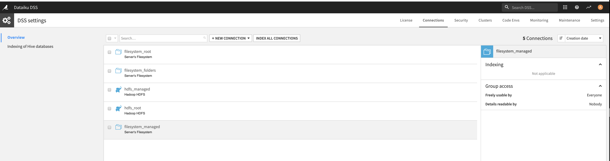
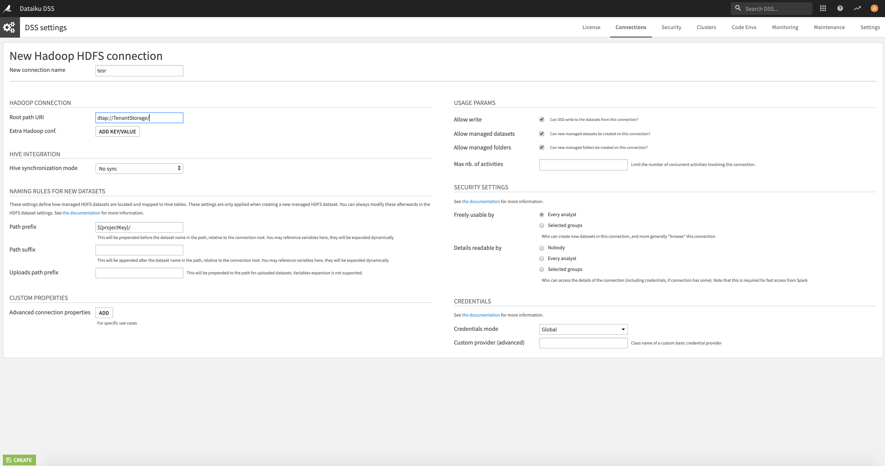
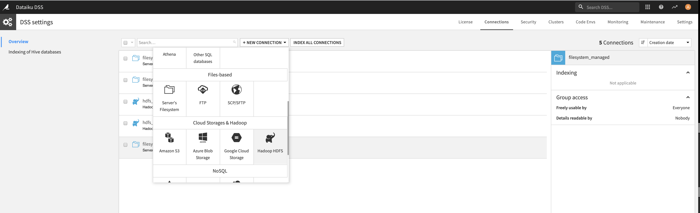
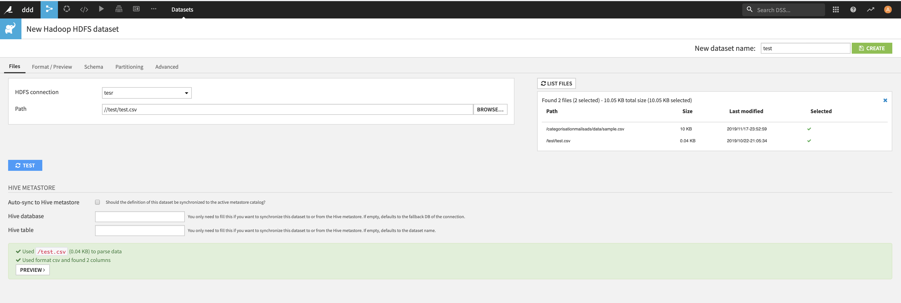
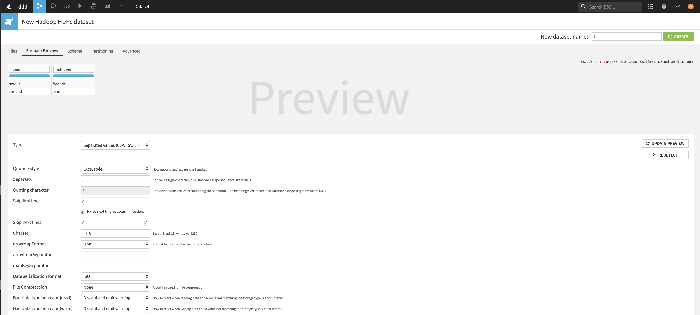

# Dataik Image

The license key is embedded into the image (valid until February 2020) and located at /home/bluedata/data/config/license.json.
Apfter creating the image in your tenant, you must see the Dataiku login page. Please Use Admin/Admin as username/password.

You wish to use a Dataiku dataset based on Datatap reference, please do the following actions:

First you have to create a new HDFS connection in Dataiku (Go into the Administration section and follow the screenshots below)

After HDFS connection creation, you can create a new dataset using the named ressource:

You can test it by listing the available files, and you can preview the data associated with a specfic file:
u

